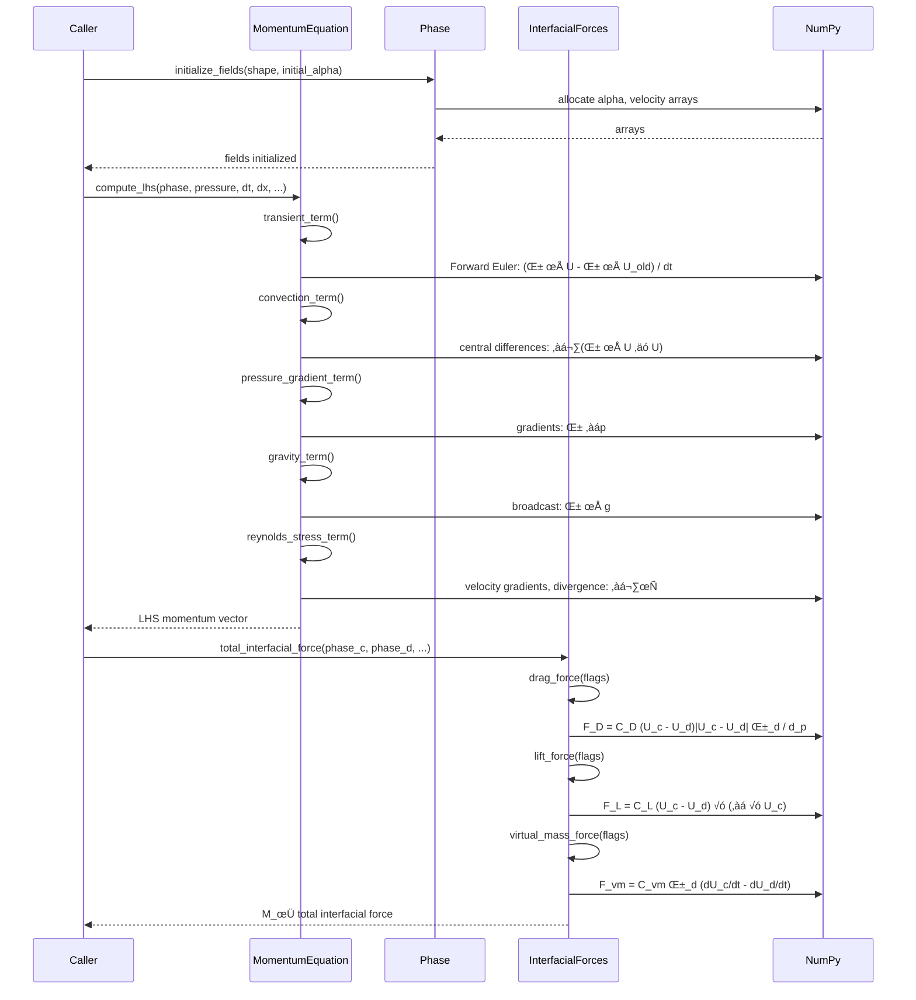

# PR #1: Build Eulerian Momentum Equation DAF Simulator - Comments

## PR-Level Comments

### @coderabbitai[bot]
<!-- This is an auto-generated comment: summarize by coderabbit.ai -->
<!-- walkthrough_start -->

## Walkthrough

A new Python package `eulerian_momentum` is introduced, implementing Eulerian multiphase flow momentum equations with Phase, MomentumEquation, and InterfacialForces classes. The package computes momentum terms (transient, convection, pressure gradient, gravity, viscous stresses) and interfacial forces (drag, lift, virtual mass, wall lubrication, turbulent dispersion) for multiphase simulations. Documentation, example scripts, and comprehensive test suites are included.

## Changes

| Cohort / File(s) | Summary |
|---|---|
| **Documentation**<br>`EQUATION_EXTRACTION.md`, `README_MOMENTUM.md` | New documentation files describing Eulerian phase momentum equations, mathematical formulation, module structure, usage examples, API reference, and testing strategy for the Dissolved Air Flotation (DAF) application context. |
| **Core Package Implementation**<br>`eulerian_momentum/__init__.py`, `eulerian_momentum/phase.py`, `eulerian_momentum/momentum_equation.py`, `eulerian_momentum/interfacial_forces.py` | New package with Phase class encapsulating phase properties and field initialization; MomentumEquation class computing all RHS terms (transient, convection, compression-expansion, Reynolds stress, pressure gradient, gravity) with finite-difference utilities; InterfacialForces class computing drag, lift, virtual mass, wall lubrication, and turbulent dispersion forces with gradient/curl helpers. Package exports public API via `__all__` and version. |
| **Example & Dependencies**<br>`example_simulation.py`, `requirements.txt` | New example script demonstrating three-phase DAF simulation workflow; requirements updated to include numpy>=1.19.0 and pytest>=6.0.0. |
| **Test Suites**<br>`tests/__init__.py`, `tests/test_phase.py`, `tests/test_momentum_equation.py`, `tests/test_interfacial_forces.py`, `tests/test_integration.py` | New test modules with 5 test classes and 30+ test methods covering Phase initialization and field operations, MomentumEquation term calculations (transient, pressure gradient, gravity, convection, Reynolds stress) in 1D/3D, InterfacialForces component validation (drag direction/magnitude, lift, virtual mass, wall lubrication, turbulent dispersion), and multi-phase integration scenarios. |

## Sequence Diagram(s)



## Estimated code review effort

🎯 4 (Complex) | ⏱️ ~75 minutes

**Areas requiring extra attention:**

- **Numerical differentiation robustness**: Verify central difference implementations in `_calculate_gradient`, `_calculate_divergence_tensor`, and `_calculate_curl` handle boundary conditions and avoid numerical artifacts, especially for 1D/3D shape transitions.
- **Broadcasting logic for volume fractions**: Confirm alpha broadcasting (scalar vs. 1D vs. 3D) is consistent across all force and momentum term calculations to prevent shape mismatches.
- **Physics correctness of drag, lift, and virtual mass**: Validate sign conventions, proportionality constants, and dimensional consistency in interfacial force formulas; cross-check against reference equations in documentation.
- **Test coverage of edge cases**: Examine test assertions for zero-velocity, zero-gradient, and boundary-proximity scenarios to ensure they test meaningful physical conditions rather than trivial cases.
- **Integration between Phase, MomentumEquation, and InterfacialForces**: Verify data flow and coordinate system consistency when phases interact across modules, especially in multiphase scenarios.

## Poem

> üê∞ Through fluids swirling, phases dance,
> Momentum traced in finite stance,
> Drag and lift in swirling play,
> Bubbles rise, particles sway,
> The Eulerian waltz lights up the way! üåä‚ú®

<!-- walkthrough_end -->


<!-- pre_merge_checks_walkthrough_start -->

## Pre-merge checks and finishing touches
<details>
<summary>‚úÖ Passed checks (3 passed)</summary>

|     Check name     | Status   | Explanation                                                                                                                                                                                                                                     |
| :----------------: | :------- | :---------------------------------------------------------------------------------------------------------------------------------------------------------------------------------------------------------------------------------------------- |
|  Description Check | ‚úÖ Passed | Check skipped - CodeRabbit's high-level summary is enabled.                                                                                                                                                                                     |
|     Title check    | ‚úÖ Passed | The title 'Build Eulerian Momentum Equation DAF Simulator' clearly and specifically summarizes the main objective of the pull request: implementing a simulator for Eulerian phase momentum equations in DAF (Dissolved Air Flotation) systems. |
| Docstring Coverage | ‚úÖ Passed | Docstring coverage is 98.59% which is sufficient. The required threshold is 80.00%.                                                                                                                                                             |

</details>

<!-- pre_merge_checks_walkthrough_end -->

---

### @gemini-code-assist[bot]
## Summary of Changes

Hello @thamam, I'm Gemini Code Assist[^1]! I'm currently reviewing this pull request and will post my feedback shortly. In the meantime, here's a summary to help you and other reviewers quickly get up to speed!

[Summary content truncated in original output]

---

## Code Review Comments

### @gemini-code-assist[bot] - eulerian_momentum/interfacial_forces.py#321
**Severity**: 

```diff
@@ -0,0 +1,375 @@
+"""
+Interfacial Forces Module
+
+Implements interfacial momentum transfer term M_φ, including:
+- Drag force
+- Lift force
+- Virtual mass force
+- Wall lubrication force
+- Turbulent dispersion force
+"""
+
+import numpy as np
+from typing import List, Dict, Optional
+from .phase import Phase
+
+
+class InterfacialForces:
+    """
+    Computes interfacial momentum transfer between phases.
+
+    The total interfacial force M_φ includes contributions from:
+    - Drag: F_D
+    - Lift: F_L
+    - Virtual mass: F_VM
+    - Wall lubrication: F_WL
+    - Turbulent dispersion: F_TD
+    """
+
+    def __init__(self):
+        """Initialize interfacial forces calculator."""
+        pass
+
+    def drag_force(
+        self,
+        phase_continuous: Phase,
+        phase_dispersed: Phase,
+        drag_coefficient: float = 0.44,
+        particle_diameter: float = 1e-4
+    ) -> np.ndarray:
+        """
+        Calculate drag force between continuous and dispersed phases.
+
+        F_D = (3/4) * (C_D / d_p) * α_d * ρ_c * |U_c - U_d| * (U_c - U_d)
+
+        Args:
+            phase_continuous: Continuous phase (e.g., water)
+            phase_dispersed: Dispersed phase (e.g., bubbles, particles)
+            drag_coefficient: Drag coefficient C_D (default: 0.44 for spheres)
+            particle_diameter: Particle/bubble diameter [m]
+
+        Returns:
+            Drag force per unit volume [N/m³]
+        """
+        # Relative velocity
+        U_rel = phase_continuous.velocity - phase_dispersed.velocity
+
+        # Magnitude of relative velocity
+        U_rel_mag = np.linalg.norm(U_rel, axis=-1, keepdims=True)
+
+        # Avoid division by zero
+        U_rel_mag = np.where(U_rel_mag < 1e-12, 1e-12, U_rel_mag)
+
+        # Volume fraction of dispersed phase
+        if len(phase_dispersed.alpha.shape) == 1:
+            alpha_d = phase_dispersed.alpha[:, np.newaxis]
+        else:
+            alpha_d = phase_dispersed.alpha[..., np.newaxis]
+
+        # Drag force
+        drag_coeff = (3.0 / 4.0) * (drag_coefficient / particle_diameter)
+        F_drag = drag_coeff * alpha_d * phase_continuous.rho * U_rel_mag * U_rel
+
+        return F_drag
+
+    def lift_force(
+        self,
+        phase_continuous: Phase,
+        phase_dispersed: Phase,
+        lift_coefficient: float = 0.5,
+        dx: float = 0.01,
+        dy: float = None,
+        dz: float = None
+    ) -> np.ndarray:
+        """
+        Calculate lift force (e.g., Saffman lift).
+
+        F_L = C_L * α_d * ρ_c * (U_c - U_d) × (∇ × U_c)
+
+        Args:
+            phase_continuous: Continuous phase
+            phase_dispersed: Dispersed phase
+            lift_coefficient: Lift coefficient C_L
+            dx, dy, dz: Grid spacings for computing curl
+
+        Returns:
+            Lift force per unit volume [N/m³]
+        """
+        # Relative velocity
+        U_rel = phase_continuous.velocity - phase_dispersed.velocity
+
+        # Compute vorticity (curl of continuous phase velocity)
+        curl_Uc = self._calculate_curl(phase_continuous.velocity, dx, dy, dz)
+
+        # Cross product: U_rel √ó curl_Uc
+        cross_product = np.cross(U_rel, curl_Uc)
+
+        # Volume fraction
+        if len(phase_dispersed.alpha.shape) == 1:
+            alpha_d = phase_dispersed.alpha[:, np.newaxis]
+        else:
+            alpha_d = phase_dispersed.alpha[..., np.newaxis]
+
+        # Lift force
+        F_lift = lift_coefficient * alpha_d * phase_continuous.rho * cross_product
+
+        return F_lift
+
+    def virtual_mass_force(
+        self,
+        phase_continuous: Phase,
+        phase_dispersed: Phase,
+        dt: float,
+        virtual_mass_coefficient: float = 0.5,
+        U_dispersed_old: Optional[np.ndarray] = None,
+        U_continuous_old: Optional[np.ndarray] = None
+    ) -> np.ndarray:
+        """
+        Calculate virtual mass force (added mass effect).
+
+        F_VM = C_VM * α_d * ρ_c * (DU_c/Dt - DU_d/Dt)
+
+        where D/Dt is the material derivative.
+
+        Args:
+            phase_continuous: Continuous phase
+            phase_dispersed: Dispersed phase
+            dt: Time step [s]
+            virtual_mass_coefficient: Virtual mass coefficient C_VM (default: 0.5)
+            U_dispersed_old: Previous dispersed phase velocity
+            U_continuous_old: Previous continuous phase velocity
+
+        Returns:
+            Virtual mass force per unit volume [N/m³]
+        """
+        # Calculate acceleration of each phase
+        if U_continuous_old is None:
+            accel_c = np.zeros_like(phase_continuous.velocity)
+        else:
            accel_c = (phase_continuous.velocity - U_continuous_old) / dt
+
+        if U_dispersed_old is None:
+            accel_d = np.zeros_like(phase_dispersed.velocity)
+        else:
+            accel_d = (phase_dispersed.velocity - U_dispersed_old) / dt
+
+        # Relative acceleration
+        accel_rel = accel_c - accel_d
+
+        # Volume fraction
+        if len(phase_dispersed.alpha.shape) == 1:
+            alpha_d = phase_dispersed.alpha[:, np.newaxis]
+        else:
+            alpha_d = phase_dispersed.alpha[..., np.newaxis]
+
+        # Virtual mass force
+        F_vm = virtual_mass_coefficient * alpha_d * phase_continuous.rho * accel_rel
+
+        return F_vm
+
+    def wall_lubrication_force(
+        self,
+        phase_dispersed: Phase,
+        wall_normal: np.ndarray,
+        distance_to_wall: np.ndarray,
+        particle_diameter: float = 1e-4,
+        C_wl: float = 0.1
+    ) -> np.ndarray:
+        """
+        Calculate wall lubrication force (prevents particles from touching walls).
+
+        This is a simplified model. More sophisticated models exist.
+
+        Args:
+            phase_dispersed: Dispersed phase
+            wall_normal: Normal vector to the wall (unit vector)
+            distance_to_wall: Distance from each point to nearest wall [m]
+            particle_diameter: Particle diameter [m]
+            C_wl: Wall lubrication coefficient
+
+        Returns:
+            Wall lubrication force per unit volume [N/m³]
+        """
+        # Expand arrays for proper broadcasting
+        if len(phase_dispersed.alpha.shape) == 1:
+            d_wall = distance_to_wall[:, np.newaxis]
+        else:
+            d_wall = distance_to_wall[..., np.newaxis]
+
+        # Force magnitude (inversely proportional to distance)
+        # Avoid singularity at wall
+        d_wall_safe = np.maximum(d_wall, particle_diameter / 10)
+
+        force_magnitude = C_wl * (particle_diameter / d_wall_safe) ** 2
+
+        # Force direction (away from wall)
+        F_wl = force_magnitude * wall_normal
+
+        return F_wl
+
+    def turbulent_dispersion_force(
+        self,
+        phase_continuous: Phase,
+        phase_dispersed: Phase,
+        turbulent_diffusivity: float,
+        dx: float,
+        dy: float = None,
+        dz: float = None
+    ) -> np.ndarray:
+        """
+        Calculate turbulent dispersion force (drives particles down concentration gradient).
+
+        F_TD = -C_TD * ρ_c * D_t * ∇α_d
+
+        Args:
+            phase_continuous: Continuous phase
+            phase_dispersed: Dispersed phase
+            turbulent_diffusivity: Turbulent diffusivity D_t [m²/s]
+            dx, dy, dz: Grid spacings
+
+        Returns:
+            Turbulent dispersion force per unit volume [N/m³]
+        """
+        # Calculate gradient of dispersed phase volume fraction
+        grad_alpha = self._calculate_gradient(phase_dispersed.alpha, dx, dy, dz)
+
+        # Turbulent dispersion force
+        F_td = -phase_continuous.rho * turbulent_diffusivity * grad_alpha
+
+        return F_td
+
+    def total_interfacial_force(
+        self,
+        phase_continuous: Phase,
+        phase_dispersed: Phase,
+        dt: float,
+        dx: float,
+        dy: float = None,
+        dz: float = None,
+        include_drag: bool = True,
+        include_lift: bool = False,
+        include_virtual_mass: bool = False,
+        include_wall_lubrication: bool = False,
+        include_turbulent_dispersion: bool = False,
+        **kwargs
+    ) -> np.ndarray:
+        """
+        Calculate total interfacial momentum transfer M_φ.
+
+        Args:
+            phase_continuous: Continuous phase
+            phase_dispersed: Dispersed phase
+            dt: Time step [s]
+            dx, dy, dz: Grid spacings [m]
+            include_*: Flags to include specific force contributions
+            **kwargs: Additional parameters for force models
+
+        Returns:
+            Total interfacial force M_φ [N/m³]
+        """
+        M_phi = np.zeros_like(phase_dispersed.velocity, dtype=np.float64)
+
+        if include_drag:
+            drag_coeff = kwargs.get('drag_coefficient', 0.44)
+            diameter = kwargs.get('particle_diameter', 1e-4)
+            M_phi += self.drag_force(phase_continuous, phase_dispersed, drag_coeff, diameter)
+
+        if include_lift:
+            lift_coeff = kwargs.get('lift_coefficient', 0.5)
+            M_phi += self.lift_force(phase_continuous, phase_dispersed, lift_coeff, dx, dy, dz)
+
+        if include_virtual_mass:
+            vm_coeff = kwargs.get('virtual_mass_coefficient', 0.5)
+            U_d_old = kwargs.get('U_dispersed_old', None)
+            U_c_old = kwargs.get('U_continuous_old', None)
+            M_phi += self.virtual_mass_force(
+                phase_continuous, phase_dispersed, dt, vm_coeff, U_d_old, U_c_old
+            )
+
+        if include_wall_lubrication:
+            wall_normal = kwargs.get('wall_normal', np.array([0, 0, 1]))
+            distance = kwargs.get('distance_to_wall', np.ones_like(phase_dispersed.alpha))
+            diameter = kwargs.get('particle_diameter', 1e-4)
+            C_wl = kwargs.get('C_wl', 0.1)
+            M_phi += self.wall_lubrication_force(phase_dispersed, wall_normal, distance, diameter, C_wl)
+
+        if include_turbulent_dispersion:
+            D_t = kwargs.get('turbulent_diffusivity', 1e-5)
+            M_phi += self.turbulent_dispersion_force(
+                phase_continuous, phase_dispersed, D_t, dx, dy, dz
+            )
+
+        return M_phi
+
+    # ==================== Helper Methods ====================
+
+    def _calculate_gradient(
+        self,
+        field: np.ndarray,
+        dx: float,
+        dy: float = None,
+        dz: float = None
+    ) -> np.ndarray:
+        """Calculate gradient of a scalar field."""
+        if len(field.shape) == 1:
+            # 1D case
+            n = field.shape[0]
+            grad = np.zeros((n, 3), dtype=np.float64)
+            grad[1:-1, 0] = (field[2:] - field[:-2]) / (2 * dx)
+            grad[0, 0] = (field[1] - field[0]) / dx
+            grad[-1, 0] = (field[-1] - field[-2]) / dx
+        else:
```

> The `_calculate_gradient` method in `interfacial_forces.py` has the same critical bug as identified in `momentum_equation.py`. For 1D cases, it incorrectly calculates the gradient along the x-direction (index 0) instead of the z-direction (index 2), which is typically expected for vertical DAF simulations. This needs to be corrected to ensure physical accuracy.
>
> ```python
>             # 1D case - assuming vertical (z-direction) domain for DAF context
>             n = field.shape[0]
>             grad = np.zeros((n, 3), dtype=np.float64)
>             # Use dz for 1D vertical gradient, fallback to dx if dz is None
>             grid_spacing = dz if dz is not None else dx
>             grad[1:-1, 2] = (field[2:] - field[:-2]) / (2 * grid_spacing)
>             grad[0, 2] = (field[1] - field[0]) / grid_spacing
>             grad[-1, 2] = (field[-1] - field[-2]) / grid_spacing
> ```

---

### @gemini-code-assist[bot] - eulerian_momentum/momentum_equation.py#313
**Severity**: 

**Comment**: Critical bug identified in `_calculate_gradient` method for 1D cases - gradient calculated along x-direction instead of z-direction for vertical DAF simulations.

[Full diff and comment details available in the PR review interface]
